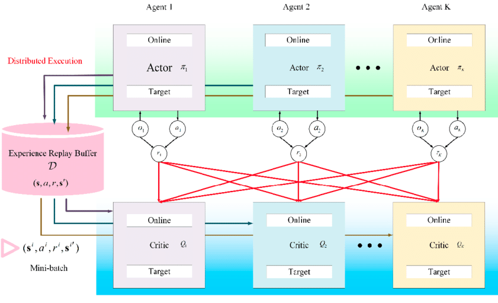

# Collaboration and Competition Solution description

The idea behind this model was took from the following paper:  “[Multi Agent Actor Critic for Mixed Cooperative Competitive environments](https://proceedings.neurips.cc/paper/2017/file/68a9750337a418a86fe06c1991a1d64c-Paper.pdf)“ which could be basically interpreted as a Multi-agent version of the DDPG model. Thus, the model we used for this problem is a Multi-Agent Deep Deterministic Policy Gradient (MADDPG).

## Learning Algorithm (MADDPG)

MADDPG main characteristics are the following:

* Centralized learning: Agents share experience during training, which is implemented via a replay memory buffer that is shared.
    * Critic is augmented with information about the policies of other agents
* Decentralized execution: Agents uses only local observations at execution time. 
    * Actor remains the same as in DDPG since it only has access to local information.

The following diagram taken from [this paper](https://www.mdpi.com/2076-3417/11/7/3101) illustrates the above ideas



### Parameters

All the parameters used in this project are stored in the following file [parameters.py](agents/maddpg/parameters.py)

The final parameters used were the following:

```python
BUFFER_SIZE = int(1e5)  # replay buffer size
BATCH_SIZE = 128        # minibatch size
GAMMA = 0.99            # discount factor
TAU = 1e-3              # for soft update of target parameters
LR_ACTOR = 1e-4         # learning rate of the actor 
LR_CRITIC = 7e-4        # learning rate of the critic
WEIGHT_DECAY = 1e-10    # L2 weight decay
NOISE = 1.0             # Noise weight [0,1] 0: no noise added, 1: full noise added
```

The optimizer used was an Adam optimizer for both neural networks.

### Architectures

Since MADDPG is an actor-critic method we have two networks, one for the actor and another for the critic. 

#### Actor

For the actor the input is the state vector, which is of a 24 size, and has the following architecture:


#### Critic

For the actor the input is a combination of the state vector and the action space of both agents, which are of a 24 and 2 size respectively. this means `input_size = (24+2)*2 = 52` Then it has the following architecture:


As you can see they are simple networks that have 2-hidden layers. One with 300 neurons and the other with 200 neurons. Also both have a Batch normalization network to regularize the learning process. The only difference is the output where the actor has 2 neurons because it predicts the actions and the critic has only 1 because it predicts the value function.


## Results

After training for 1139 episodes we finally solved the problem which is better illustrated by the following plot of rewards:

| <b>2-Agents plot of rewards</b>|
|:--:|
|  |


where we can see that around episode 1139 we solve the problem because the mean score of the 2 agents reached more than 0.5 in 100 consecutive episodes.

Nevertheless, as you can see above I also wanted to achieve a better result so I left it training until an average score of 1.0 was reached. This value was reached at episode 1317.

I also recorded the model at different stages of the training process which are all stored in the folder: [checkpoints](checkpoints/). This allowed us to see how the model was learning during the training process. The final outcome when reached the avg score of 1.0 is shown below:

<p align="center">

</p>

## Future work ideas

To improve the performance in this project I have some ideas that I would like to implement, the following is a list of all the ideas I have so far for this project:

1. Replace the replay buffer with a [prioritized experience replay](https://arxiv.org/abs/1511.05952?context=cs). The replay buffer randomly sample through the experiences, however, the prioritized experience replay stores more information that associates every experience with additional information, its priority, probability and weight. This way more relevant experiences are more likely to be sampled.  
2. Implement Proximal Policy Optimization (PPO) which has demostrated great performance as shown in the [openai page](https://openai.com/blog/openai-baselines-ppo/)
3. Also would like to try one of the newest models [Distributed Distributional Deterministic Policy Gradients](https://openreview.net/forum?id=SyZipzbCb) which is another method to adapt DDPG for continuous control.
